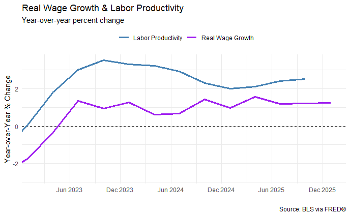
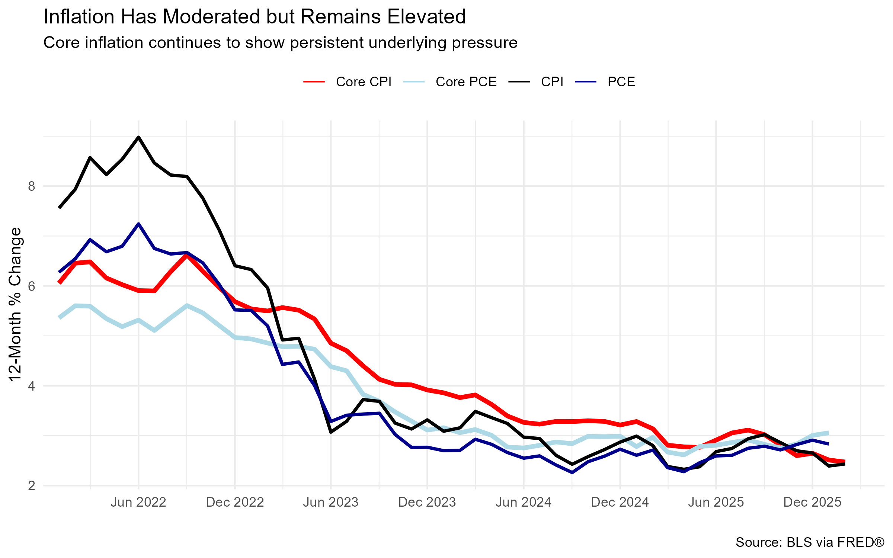

# U.S. Inflation Dynamics Analysis (R + FRED Data)
## Overview
This project analyzes U.S. inflation trends as of March 2026 using data from the Federal Reserve Economic Data (FRED). The goal is to identify the key drivers of inflation and evaluate whether current pressures are likely to persist.

The analysis is structured similarly to a professional economic brief, incorporating multiple indicators including CPI, PCE, energy prices, wages, productivity, and the yield curve.

## Key Questions
- Is inflation still elevated relative to historical trends?
- Are energy prices driving inflation?
- Are wages converging toward productivity, or does this signal building demand pressure?
- What is the yield curve signaling about future economic conditions?

## Key Insights
- Inflation has moderated but remains above target levels
- Wages converging toward productivity levels signal building demand-side inflationary pressure
- Energy prices contribute to short-term volatility but are not the primary driver
- The yield curve signals elevated recession risk

## Tools & Skills Demonstrated
- R(tidyverse, ggplot2)
- Time-Series analysis
- Economic reasoning and storytelling
- Data visualization and report design

## View Full Report
👉 [Click here to view the full report](https://hmaydata.github.io/us-inflation-analysis/inflation_analysis.html)

## Sample Visualizations

### Wage Growth vs Productivity

### Inflation Trends

## Project Structure
- inflation_analysis.Rmd -- full analysis and code
- inflation_analysis.html -- final report
- outputs/figures/ -- visualizations

## Why this Project Matters
This project demonstrates the ability to combine data analysis with economic intuition to produce insights similar to professional research reports (e.g., Federal Reserve-style analysis).
